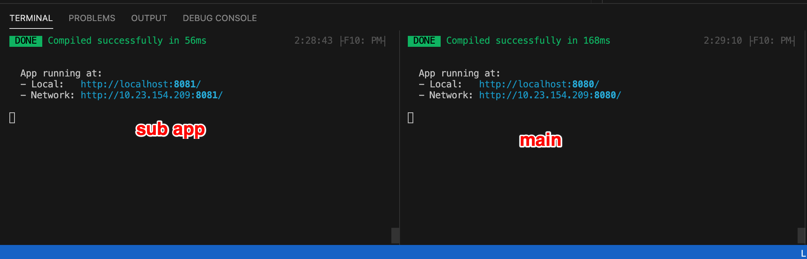
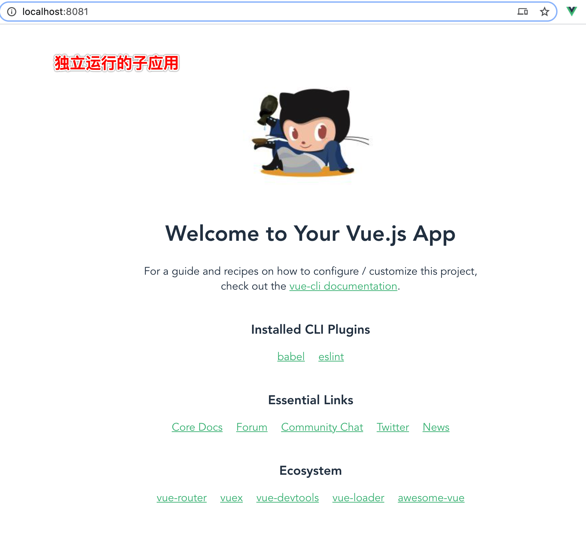
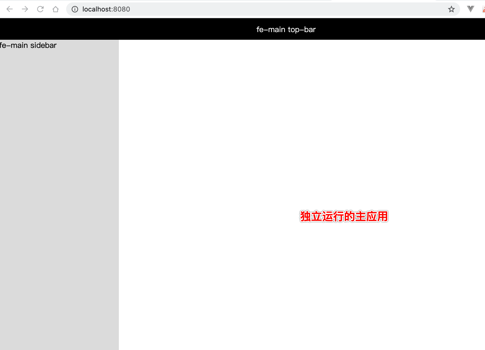
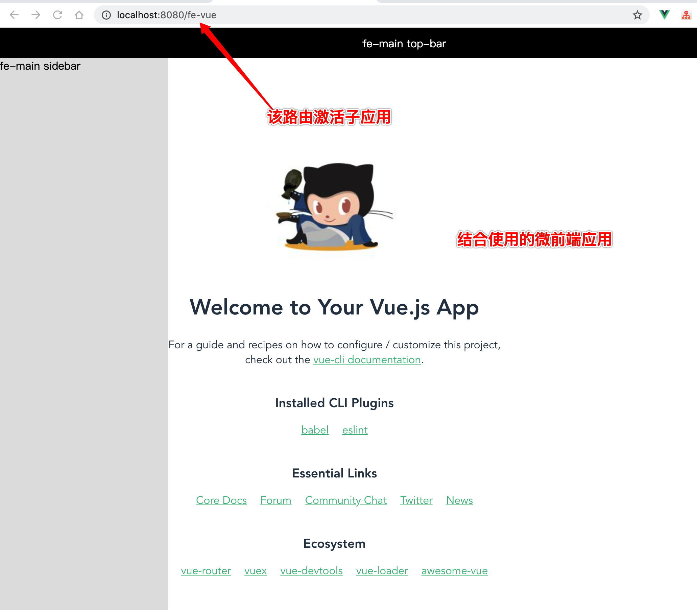

# 用monorepo管理多种技术实践Demo
<!-- ## 实践技术概览
- Lerna【monorepo解决方案】：https://github.com/lerna/lerna
- Qiankun【微前端解决方案】：https://qiankun.umijs.org/zh/guide/getting-started
- VueJS【广泛使用的前端框架】：https://cn.vuejs.org/v2/guide/
- MidwayJS【基于EggJS的上层node框架】：https://midwayjs.org/midway/guide.html#%E5%BF%AB%E9%80%9F%E4%B8%8A%E6%89%8B -->

## Packages：子应用说明
- ai-ml5js: 前端深度学习框架，在浏览器运行的AI
- fe-electron: electorn 客户端应用开发
- fe-qiankun：qiankun框架主应用
- fe-reactnative：reactnative、expo框架
- fe-vue：vuejs + qiankun子应用
- graph-mind: xmind图、脑图Demo
- node-midway：midwayjs框架
- server-config：mongo、pm2、nginx等配置
- mini-douyin-ceyice：抖音小程序demo
- mini-wechat-baoquduanzi：微信小程序demo

## Lerna基础命令
- lerna init：新建monorepo
- lerna bootstrap：安装所有子应用依赖
- lerna create [subapp]：新建子应用

## Qiankun： 微前端方案 使用示例
1. 分别运行主应用(fe-qiankun)8080端口、子应用(fe-vue)8081端口

2. 独立运行的子应用

3. 独立运行的主应用

4. 结合使用微前端
