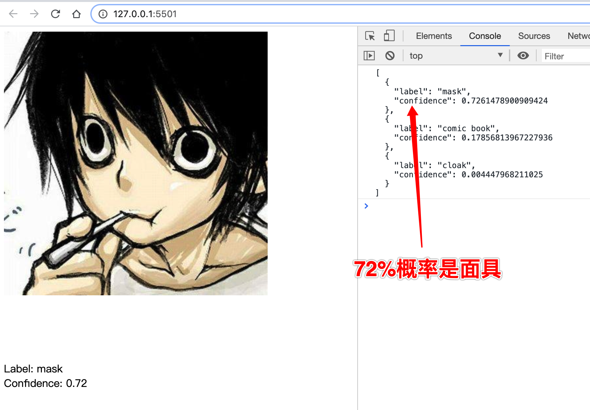
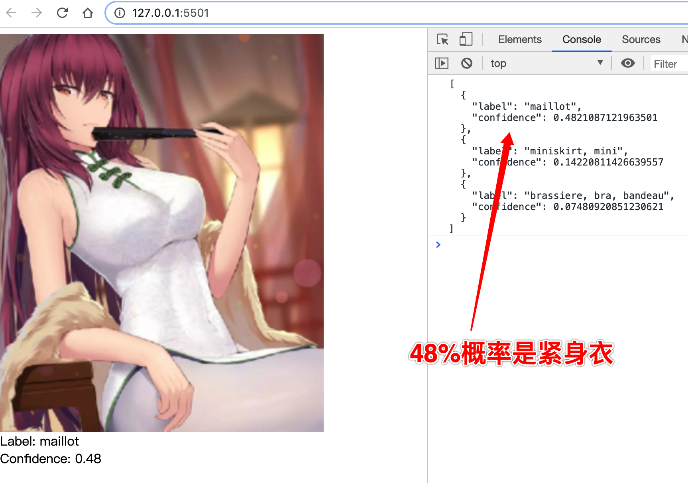
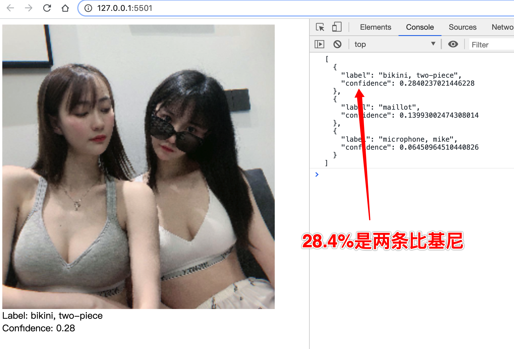
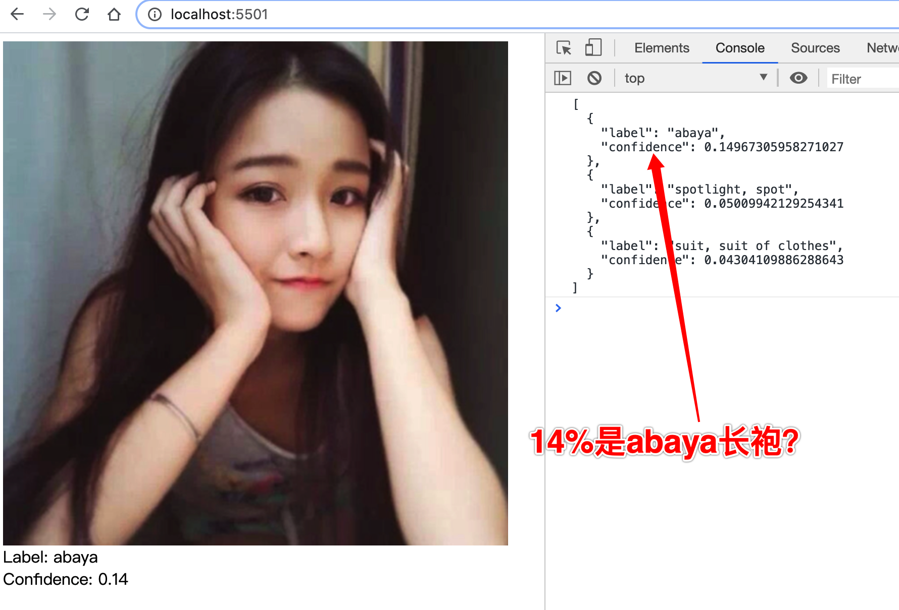

### 项目简介
- 前端使用ml5.js，在浏览器中跑图片识别模型
- 图片识别模型使用ML5预置的MobileNet
- 项目主要展示了和ml5库的基础使用 和 几个demo图片的识别效果
- ML5文档：https://ml5js.org/

### 使用指南
- clone本项目，在images目录下添加你想测试的图片，修改代码
- 使用vscode liveserver或者nginx作为你的web服务器
- 打开本地网站，打开控制台，就可以看到图片模型识别的信息

### Pre-model 效果展示

### 未完待续...
 可以从上图中看到图片模型识别的效果，误差还是很大的！

 不过图片识别还是非常有意思的，目前demo只是使用了官方库预置的算法模型。后续会尝试自己训练使用，欢迎关注该项目~~~
