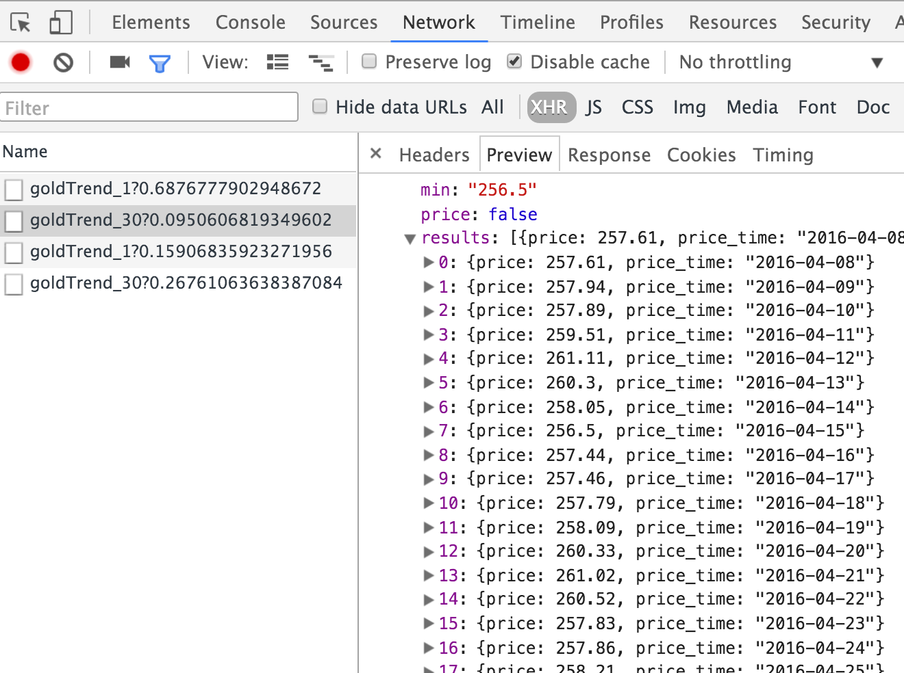

### age-tree 远古之树: Personal Website BackEnd
基于koa，根据项目配置自动加载 中间件／模块

##### environment
- node 4+++++
- babel stage-0
- [koa2](https://github.com/koajs/koa/tree/v2.x/docs)
- [babel](https://babeljs.io/docs/usage/cli/#babel-node)

##### Project Struct
```shell
- doc/
- script/
- src/
  |-- config (公共配置，中间件，服务)
  |-- controllers (控制器)
  |-- middleware (中间件：koa use)
  |-- models     (模型层)
  |-- service    (服务层，logic)
  |-- app.js 		 (app初始化)
  |-- DI.js      (依赖注入)
  |-- server.js  (server启动)
- test/ (测试)

```

##### run （package.json scripts）
-	npm start

##### features
-	gold price trend analyze from [微财富](https://gold.weicaifu.com/gold/goldTrend_30)（这里用了别人的api还是给他打个广告吧）

 1:获取gold price api（随便找的）:
 

 2:每日定时请求新浪api，获取数据存入mongo

 3:age-tree gold api 每次返回所有数据，用以分析

 4:将返回的数据展示在页面，曲线图使用canvas

- other features ing......
